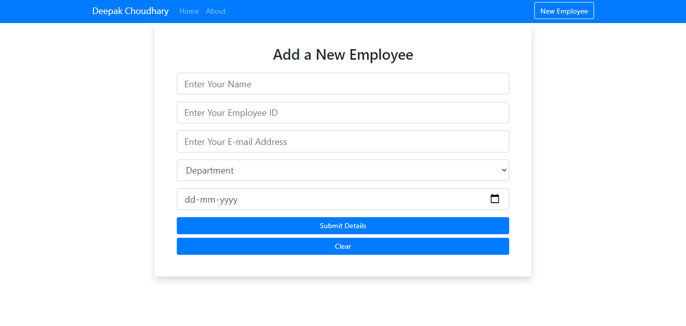
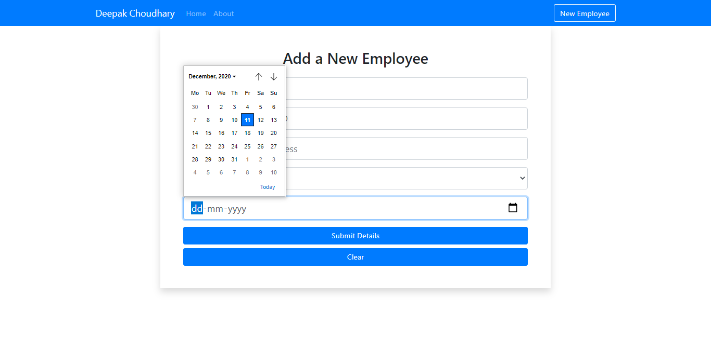
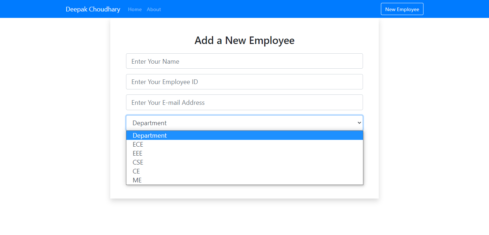
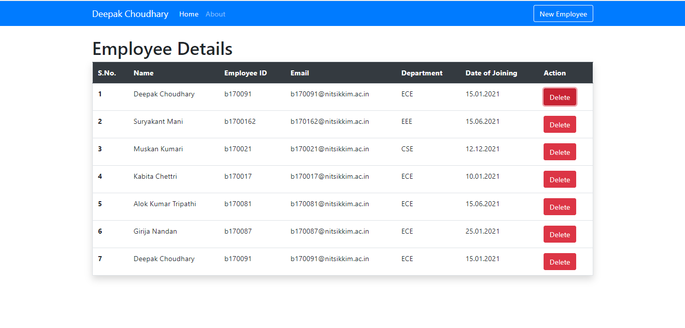

# EMPLOYEE TABLE 

## Description


### Installing

In order to create this project  you will need to make sure that the following dependencies are installed:
```
1.
  - npx create-react-app  new-employee
  - cd new-employee
  - npm start
  - npm install react-axios
  - npm install --save react-router-dom
  - npm install json server
  - npm install -g concurrently

 To run the project at local host: npm run start:dev   
 ```

## Project Layout

 

 

 

 
### Folder structure

Here's a folder structure for a Pandoc document:

```
new-employee/     # Root directory.
|- Public/       # Folder used to store index.html file.
|- src/          # folder used for js and css files.
```

